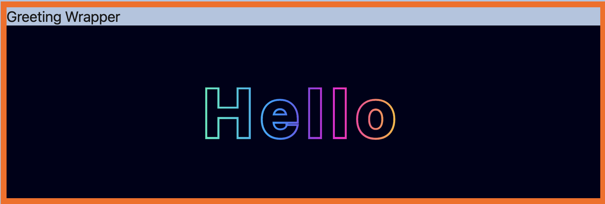

# Using LWC's Across Namespaces

This repository consists of two projects, Greeting and CombinedGreeting. The CombinedGreeting project has a managed package dependency on Greeting and utilizes LWC's from the Greeting package.

- [Using LWC's Across Namespaces](#using-lwcs-across-namespaces)
  - [What's in the packages?](#whats-in-the-packages)
    - [Greeting](#greeting)
    - [Combined Greeting](#combined-greeting)
  - [Package Versions](#package-versions)
  - [Deployment Steps](#deployment-steps)

## What's in the packages?

### Greeting

Greeting is built in the `mvpbo2` namespace an consists of a single Lightning Web Component named `hello`. The `hello` component renders a "hello" greeting in various languages depending on the two character language code provide in the language attribute.

`<mvpbo2-hello language="it"></mvpbo2-hello>`

### Combined Greeting

CombinedGreeting is built in the `mvpbo3` namespace and consists of a Lightning Web Component as well as a Home Page Flexipage. The LWC is named `greetingWrapper`, is wrapped in an orange border, has a header with the component name, and contains the `hello` component from the Greeting package. The `ConsumerAppPage` Flexipage contains both the `greetingWrapper` and `hello` LWC's as an example of using the dependent components in multiple ways.

`<greetingWrapper lang="en"></greetingWrapper>`

## Package Versions

| Namespace | Name             | Package Version Id | Package Version Number |
| --------- | ---------------- | ------------------ | ---------------------- |
| mvpbo3    | combinedGreeting | 0.1.0-2            | 04tHs000000BxUQIA0     |
| mvpbo2    | greeting         | 0.1.0-1            | 04tHs000000BxUBIA0     |

## Deployment Steps

Start by deploying the dependent package first.

Install the Greeting package

`sf package install -p 04tHs000000BxUBIA0 -w 10 -o {orgalias}`

Install the CombinedGreeting package

`sf package install -p 04tHs000000BxUQIA0 -w 10 -o {orgalias}`
